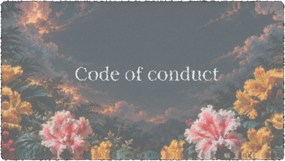

## Our Pledge

As contributors, maintainers, and members of the community, we are committed to creating a safe, inclusive, respectful, and welcoming environment for everyone involved in the project.

We strive to maintain a community where people can participate freely and collaborate without harassment, discrimination, intimidation, or hostility, regardless of age, disability, ethnicity, gender identity, experience level, education, nationality, appearance, race, religion, or sexual orientation.

## Our Standards

Examples of behavior that help create a positive community include:

- Treating everyone with respect and consideration
- Sharing feedback in a constructive and respectful manner
- Being open to different ideas, opinions, and perspectives
- Using welcoming and inclusive language
- Supporting others in learning and improving

Examples of unacceptable behavior include:

- Harassment, threats, intimidation, or personal attacks
- Offensive or discriminatory comments, whether verbal, written, or visual
- Sharing sexually explicit, violent, or inappropriate content
- Trolling, insulting others, or intentionally disrupting discussions
- Sharing someone's private or personal information without their permission

## Our Responsibilities

Project maintainers are responsible for:

- Establishing and maintaining appropriate standards of behavior
- Addressing violations of the Code of Conduct appropriately
- Taking necessary corrective measures when unacceptable behavior occurs
- Temporarily or permanently restricting participation when serious or repeated violations occur

## Scope

This Code of Conduct applies to all project-related spaces, including GitHub issues, discussions, pull requests, code reviews, and external communication channels associated with the project.

It also applies when an individual is representing the project or its community in a public setting.

## Enforcement

Unacceptable or inappropriate behavior may be reported to the project maintainers through the available project communication channels.

Reports may include:

- Reporting the issue through the appropriate repository channel
- Contacting a project maintainer directly through the available contact methods

All reports will be reviewed carefully and handled fairly.

Maintainers will make reasonable efforts to protect the confidentiality and privacy of individuals involved in a report.

## Enforcement Guidelines

Depending on the nature and severity of a violation, maintainers may take the following actions:

1. **Warning** – A private notice explaining the concern and the expected behavior.
2. **Temporary Suspension** – A temporary restriction from participating in project activities or community spaces.
3. **Permanent Ban** – Permanent removal from project participation in cases involving severe or repeated violations.

The appropriate action will be determined based on the circumstances of each incident.

## Attribution

This Code of Conduct is based on principles established by the [Contributor Covenant](https://www.contributor-covenant.org/), version 2.1.